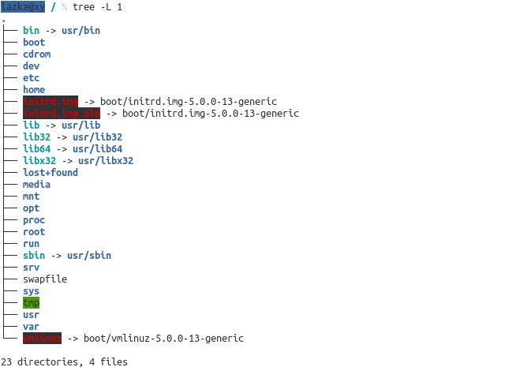
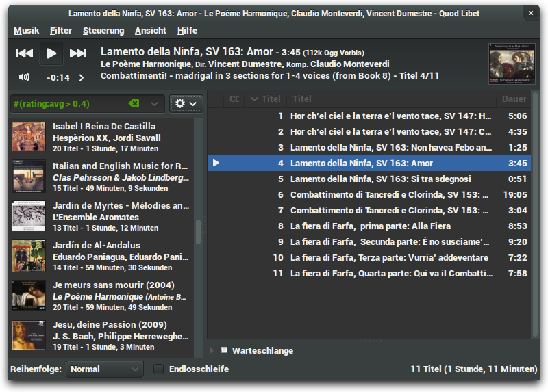
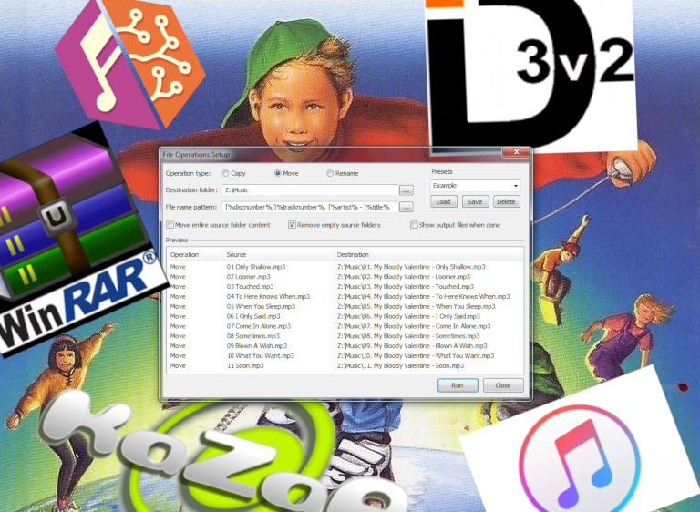
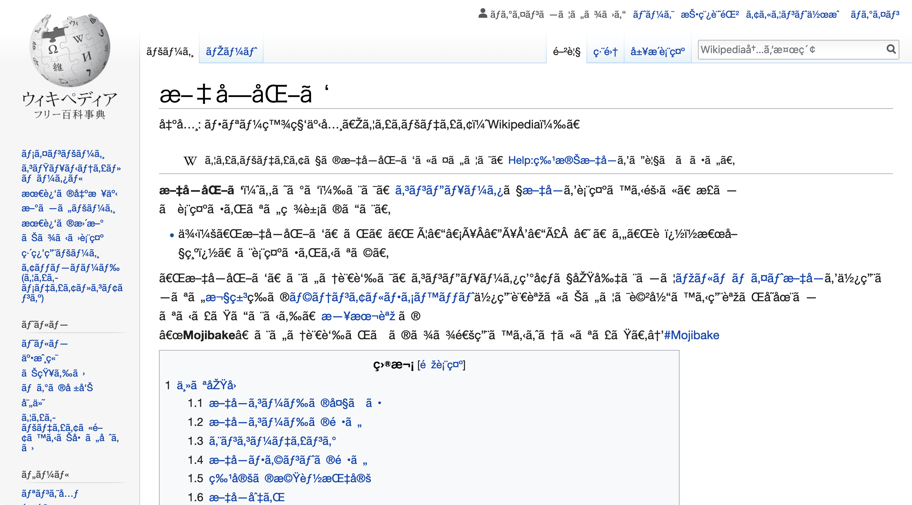
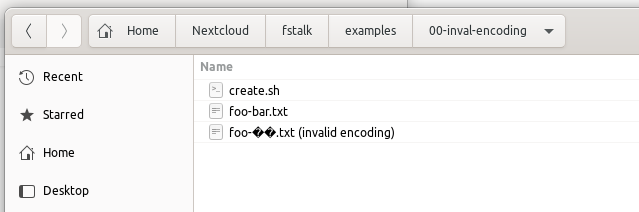
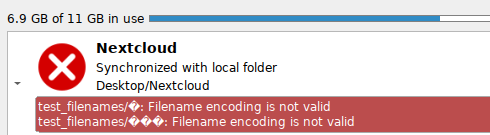
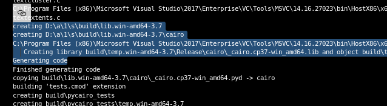
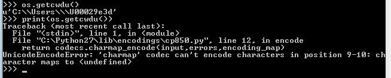
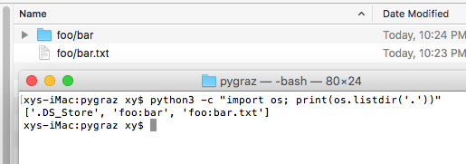
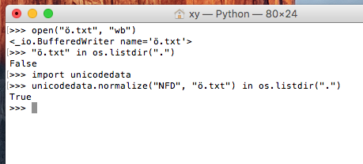

The Missing Filesystem Path Type
################################

.. class:: center

    Christoph Reiter @ PyGRAZ 2019-11-05



.. raw:: pdf

    PageBreak



.. raw:: pdf

    PageBreak



.. raw:: pdf

    PageBreak



.. raw:: pdf

    PageBreak

.. raw:: pdf

    Spacer 0,45

.. code:: bash

    python3 -c "import sys; print(sys.argv[1])" *.txt
    Traceback (most recent call last):
    File "<string>", line 1, in <module>
    UnicodeEncodeError: 'utf-8' codec can't encode characters in position 0-1: surrogates not allowed

.. raw:: pdf

    Spacer 0,15

.. code:: bash

    python3 -c "import os;  os.mkdir('\xf6')"
    Traceback (most recent call last):
    File "<string>", line 1, in <module>
    UnicodeEncodeError: 'ascii' codec can't encode character '\xf6' in position 0: ordinal not in range(128)


stdlib: str / bytes / unicode / pathlib
---------------------------------------

https://docs.python.org/3/library: os.path, pathlib, os.environ, sys.argv, os.getcwd, getcwdb, tempfile, open(), io, os.environb

.. code:: pycon

    >>> os.listdir(u"/sys")
    ['kernel', 'power', 'class', 'devices', 'dev', 'hypervisor', 'fs']
    >>> os.listdir(b"/sys")
    [b'kernel', b'power', b'class', b'devices', b'dev', b'hypervisor', b'fs']
    >>> os.listdir(pathlib.Path("/sys"))
    ['kernel', 'power', 'class', 'devices', 'dev', 'hypervisor', 'fs']
    >>> tempfile.mkstemp("foo", "bar")
    (3, '/tmp/barg6vl4_ykfoo')
    >>> tempfile.mkstemp("foo", b"bar") # also os.path.join(b"", "")
    TypeError: Can't mix bytes and non-bytes in path components.

* In general: The type that gets passed in also gets passed out
* pathlib is converted to ``str`` first, so ``str`` is returned
* Functions taking multiple paths need one shared type (since Python 3)


Filesystem Encoding on Linux
----------------------------

.. code:: pycon

    >>> import os
    >>> os.listdir(".")
    ['foo-bar.txt', 'foo-\udcff\udcfe.txt', 'create.sh']
    >>> os.listdir(".")[0].encode("utf-8")
    b'foo-bar.txt'
    >>> os.listdir(".")[1].encode("utf-8")
    Traceback (most recent call last):
    File "<stdin>", line 1, in <module>
    UnicodeEncodeError: 'utf-8' codec can't encode characters in position 4-5: surrogates not allowed
    >>> os.listdir(".")[1].encode("utf-8", "surrogateescape")
    b'foo-\xff\xfe.txt'
    >>> 

-> **surrogates ?**

-> **surrogateescape ?**

How do Programs handle these?
-----------------------------



----




Surrogates
----------

https://www.ling.upenn.edu/courses/Spring_2003/ling538/UnicodeRanges.html

* D800-DBFF: High Surrogate Area
* DC00-DFFF: Low Surrogate Area

https://en.wikipedia.org/wiki/Universal_Coded_Character_Set#History

* In the beginning Unicode fit into 16 bit (UCS-2 encoding), turned out to be not enough
* Unicode was extended to fit into 32 bit, UCS-2 was upgraded to UTF-16
* The (unallocated) surrogate areas are re-used to encode code points outside of UCS-2,
  by using them in pairs, so called surrogate-pairs.

Utf-16 Emoji Example
--------------------

.. code:: pycon

    >>> u = "😊"  # <- supposed to be a smiley emoji ":)"
    >>> len(u), hex(ord(u))
    (1, '0x1f60a')
    >>> 0x1f60a
    128522  # doesn't fit 16bit
    >>> 2**16
    65536
    >>> hex(0x1f60a - 0x10000)  # remove offset
    '0xf60a'
    >>> high = 0xf60a >> 10
    >>> low = 0xf60a & 0b1111111111
    >>> hex(high)
    '0x3d'
    >>> hex(low)
    '0x20a'
    >>> (hex(0xD800 + high), hex(0xDC00 + low)) # split bits and offset into surrogate block
    ('0xd83d', '0xde0a')
    >>> u
    '😊'
    >>> [hex(c) for c in u.encode("utf-16-be")]
    ['0xd8', '0x3d', '0xde', '0xa']  # same values as above
    # decoding a long surrogate will lead to errors
    >>> u.encode("utf-16-be")[:2].decode("utf-16-be")
    UnicodeDecodeError: 'utf-16-be' codec can't decode bytes in position 0-1: unexpected end of data
    >>> u.encode("utf-16-be")[2:].decode("utf-16-be")
    UnicodeDecodeError: 'utf-16-be' codec can't decode bytes in position 0-1: illegal encoding

UTF-16 and Surrogates
---------------------

* UTF-16 not strictly a superset of UCS-2 because previously valid strings with code points in
  the surrogate range no longer valid. C APIs couldn't just reject data they previously accepted.
* APIs worked with 16bit values and couldn't be changed anymore (wchar_t on Windows)
* Examples: JS strings in browsers, Java etc.

Python 2/3 Differences
----------------------

In Python 2 surrogates where handled like every other codepoint in the utf-x codec family.

.. code:: pycon

    >>> # Python 2
    >>> u"\udcee".encode("utf-16-le").decode("utf-16-le")
    # ???
    >>> u"\udcee".encode("utf-8").decode("utf-8")
    # ???

Surrogates can create problems if they end up in utf-8/16 text that gets passed
to other programs. e.g. glib based programs will error out.

Python 3 finally doesn't allow them by default ``\o/``, except in filesystem paths ``:(``


'surrogateescape' Error Handler
-------------------------------

https://www.python.org/dev/peps/pep-0383/ (Python 3.1)


    "File names, environment variables, and command line arguments are defined as
    being character data in POSIX; the C APIs however allow passing arbitrary bytes
    - whether these conform to a certain encoding or not. This PEP proposes a means
    of dealing with such irregularities by embedding the bytes in character strings
    in such a way that allows recreation of the original byte string."

    "With this PEP, non-decodable bytes >= 128 will be represented as lone
    surrogate codes U+DC80..U+DCFF."

1) Python decodes filesystem paths (bytes)
2) In case of errors embeddeds affected bytes in lone surrogates
3) When passing the string back to the OS it extracts them again without losing information

'surrogateescape': The Good and the Bad
---------------------------------------

* **Bad:** ``"some string: " + os.path.basename(path)`` could result in an invalid unicode string by accident.
  No way to tell if the string is potentially invalid and with which codec it was created.

----

* **Good:** Even if decoding fails, some operations still work: ``"invalid-\udcee-name.txt".endswith(".txt")``.
  In the common case the user can just assume that they are strings.


Codec Error Handlers
--------------------

Common codec error handlers: 'strict', 'ignore', 'replace'.

.. code:: pycon

    >>> b"a\xffb".decode("ascii", "strict") # <- default
    UnicodeDecodeError: 'ascii' codec can't decode byte 0xff in position 1: ordinal not in range(128)
    >>> b"a\xffb".decode("ascii", "replace")
    'a�b'  # � <- "REPLACEMENT CHARACTER"
    >>> b"a\xffb".decode("ascii", "ignore")
    'ab'
    >>> 

But there are more: ``xmlcharrefreplace``, ``backslashreplace``, ``namereplace``, ``surrogateescape``, ``surrogatepass``

https://docs.python.org/3/library/codecs.html#error-handlers

User defined error handlers possible: https://www.python.org/dev/peps/pep-0293/ (Python 2.3)

    "This PEP aims at extending Python's fixed codec error handling schemes with a
    more flexible callback based approach."


Custom Error Handlers
---------------------

We can create our own error handler which receives a UnicodeError and can decide
what output to produce based on the input.

.. code:: python

    import codecs

    def pygraz(error):
        # UnicodeError -> (replacement, newpos)
        return ("[pygraz]", error.end)

    # pygraz custom handler
    codecs.register_error("pygraz", pygraz)
    >>> print(b"hallo-\xff!".decode("ascii", "pygraz"))
    hallo-[pygraz]!
    >>> print("hallo-ß!".encode("ascii", "pygraz"))
    b'hallo-[pygraz]!'
    # surrogateescape
    se = codecs.lookup_error("surrogateescape")
    >>> se(UnicodeDecodeError('ascii', b"\xee", 0, 1, "broken whatever"))     #
    ('\udcee', 1)


What's the Filesystem Encoding?
-------------------------------

We've used UTF-8 for now, but is it always that way?

----

**NO :( (but most of the time yes)**

* The filesystem encoding is read from ``LC_CTYPE`` env var of the current locale (see the ``locale`` command).
* You can see the available locales with ``locale -a``
* In Python: ``sys.getfilesystemencoding()``


What's the Filesystem Encoding?
-------------------------------

.. code:: bash

    $ locale
    LANG=en_US.UTF-8
    LANGUAGE=
    LC_CTYPE="en_US.UTF-8"
    ...
    LC_ALL=
    $ locale -a
    C
    C.UTF-8

* Once special locale that is always available: ``C`` or ``POSIX`` (the same), ASCII encoding
* In newer distros, also ``C.UTF-8`` **<- use this instead of C!**
* Many docker images default to ``C``, can be fixed with ``ENV LC_ALL C.UTF-8``

What's the Filesystem Encoding?
-------------------------------

Related Python API:

.. code:: pycon

    >>> import sys, os
    >>> sys.getfilesystemencoding()
    'utf-8'
    >>> os.fsencode("\udcee")
    b'\xee'
    >>> os.fsdecode(b"\xee")
    '\udcee'
    >>> 

**Note:** ``os.fsdecode()`` will pass through ``str`` and not validate them.
Returned value not stricly valid.

What's the Filesystem Encoding?
-------------------------------

In 99% of cases UTF-8 or POSIX/C because it's the default fallback (SSH, Docker).
Ideally it would be UTF-8 always.

New PEPs to the rescue:

* https://www.python.org/dev/peps/pep-0538/ (Python 3.7)

  "Coercing the legacy C locale to a UTF-8 based locale"

  Will set LC_CTYPE to UTF-8 in case the POSIX locale is active
* https://www.python.org/dev/peps/pep-0540/ (Python 3.7)

  "Add a new UTF-8 Mode"

  Will use UTF-8 everywhere in case of the POSIX locale


What's the Filesystem Encoding?
-------------------------------

Python 3.6::

    LANG=C python3 -c "import sys; print(sys.getfilesystemencoding())"
    ascii

Python 3.7::

    LANG=C python3 -c "import sys; print(sys.getfilesystemencoding())"
    utf-8

----

With this in 99% of cases you will get "utf-8" and most fs encoding problems are
gone for Python 3 users ``\o/``


Linux Filesystem Paths
----------------------

``Posix Standard``: https://pubs.opengroup.org/onlinepubs/009695399/basedefs/xbd_chap03.html

* Absolute: ``/foo/bar/quux``
* Relative ``foo/bar``, ``../foo``, ``./foo``
* Directory in every directory pointing to the directory itself: `.`
* Directory in every directory pointing to the parent `..`, or itself in case of ``/``

----

* Paths starting with exactly two ``/`` are implementation defined (Linux doesn't do anything special)
* Multiple slahes are otherwise considered one slash: ``/foo//bar`` == ``/foo/bar``
* Paths ending with trailing slash(es) as if they have an implicit trailing ``"."``: ``/foo////`` == ``/foo/.``

Linux Filesystem Paths
----------------------

* ``os.path`` and ``pathlib`` abstract most of this away across platforms.
* ``os.path.basename('/foo///')`` -> Output?
* ``pathlib``` is easier in this case
* ``os.path`` doesn't follow the posix lookup rules, use ``os.path.normpath()`` first

Linux Filesystem Paths
----------------------

In some cases you want multiple paths in one string (for example the PATH env var)

Use ``os.pathsep``.

----

How does it work if ":" is contained in one of the paths? Escape it?

----

**Since <colon> is a separator in this context, directory names that might be used in PATH should not include a <colon> character.**

https://pubs.opengroup.org/onlinepubs/9699919799/basedefs/V1_chap08.html#tag_08_03


Linux Path Limits
-----------------

**It depends :/** -> https://en.wikipedia.org/wiki/Comparison_of_file_systems#Limits

* Limitations because of the on-disk-format
* Limitations because of the OS APIs

ext4: 255 bytes for a filename, 4096 bytes for a path

.. code:: pycon

    >> os.stat("/abcde" + "/f" * 2045)
    OSError: [Errno 36] File name too long:...
    >>> os.mkdir("a" * 256)
    OSError: [Errno 36] File name too long:...


Case Insensitive Filesystems?
-----------------------------

EXT4 added a case insensitive + normalization lookup in Linux 5.2 (inspired by macos APFS)

See https://lwn.net/Articles/784041/

* Kernel has to be build with ``CONFIG_UNICODE`` (Arch/Ubuntu do by default)
* ``mkfs.ext4 -E encoding=utf8`` <- needs to be specified at format time (stores the current unicode version on disk)
* ``chattr +F <some-empty-dir>`` <- can be enabled for empty directories
* Does case normalization and NFD normalization on lookup
* Similar to when you mount FAT32 or NTFS, except they only do case normalization.
* (In theory case folding depends on the locale... https://www.w3.org/International/wiki/Case_folding)

Demo...
~~~~~~~

Windows
-------

::

    # https://docs.microsoft.com/en-us/windows/win32/fileio/naming-a-file            .
    # https://en.wikipedia.org/wiki/Path_(computing)
    \ (relative to current working directory root)
    or [drive_letter]:\
    or \\[server]\[sharename]\
    or \\?\[drive_spec]:\
    or \\?\[server]\[sharename]\
    or \\?\UNC\[server]\[sharename]\
    or \\.\[physical_device]\

* ``"\\\\?\\"`` <- Prefix for "long paths" (get sent straight to the FS)
* ``"/"`` is the same as ``"\\"``, except for paths starting with ``"\\\\?\\"``
* ``\\\\[server]\\[sharename]\\`` <- UNC paths (Universal Naming Convention), Network shares etc.
* If a program can't handle UNC paths, mount the network share as a drive.
* Lookup case insensitive

Windows
-------

* Special reserved characters: <>:"/\\|?*
* An easy way to get a valid filename is ``urllib.parse.quote(path, '/\\\\')``
* Special reserved filenames: CON, PRN, AUX, NUL, COM1, COM2, COM3, COM4, COM5, COM6, COM7, COM8, COM9,
  LPT1, LPT2, LPT3, LPT4, LPT5, LPT6, LPT7, LPT8, and LPT9
* Of these "NUL" is useful, similar to ``/dev/null`` on Unix, see ``os.devnull``


-----

Unrelated Trick: Windows does env var expansion in various places like ``explorer.exe``: ``%USERPROFILE%/Downloads``.
Most important directories have a corresponding env var you can use.
Also see ``os.path.expandvars()`` in Python.

Windows Path Length Limit
-------------------------

* Windows has a very low limit for the path length by default -> 260
* In Windows 10 this limit can be removed for most functions, but needs changes to the system and the app.
* The Python Windows installer suggests adding the registry entry for you:


https://docs.python.org/3/using/windows.html?highlight=max_path#removing-the-max-path-limitation

Windows Path Length Limit
-------------------------



Microsoft being afrait to hit the path limit on Azure Pipelines

----

Path length limit problems in meson: https://github.com/mesonbuild/meson/issues/4226


Windows Path Encoding/API History
---------------------------------

* On Windows instead of a locale encoding there is a "Windows Code Page" (also called ANSI Code Page)
* When Unicode came out Windows duplicated all its API and split it into ANSI versions and WIDE (wchar_t) version:

  * CreateDirectoryA: https://docs.microsoft.com/en-us/windows/win32/api/fileapi/nf-fileapi-createdirectorya
  * CreateDirectoryW: https://docs.microsoft.com/en-us/windows/win32/api/fileapi/nf-fileapi-createdirectoryw

* They initially used UCS-2 but when Unicode got extended they switched to UTF-16
* Because they couldn't error out on surrogates they still allow them -> WTF-16

https://docs.microsoft.com/en-us/windows/win32/intl/unicode-in-the-windows-api

Windows Paths Python History
----------------------------

* When Unicode came out Python got the new ``unicode`` type and Windows got the WIDE APIs
* Using the ``unicode`` type with OS functions used the W APIs while using ``str/bytes``
  used the A APIs. -> https://www.python.org/dev/peps/pep-0277/ (Python 2.3)
  "Unicode file name support for Windows NT"
* `mbcs` is an encoder for the active code page (a "meta encoder")
* Still the same split when Python3 came out: bytes uses A API, str uses W API.
  Paths can contain surrogates, this time not to smuggle bytes, but to smuggle themselves.

----

Problem: ``bytes`` work on Unix for paths, but on Windows they don't support
Unicode. The code page is different on different Windows versions to somewhat
support the local language.

Switch to UTF-8 on Windows
--------------------------

https://www.python.org/dev/peps/pep-0529/ (Python 3.6)

    "Change Windows filesystem encoding to UTF-8"

* `sys.getfilesystemencoding() ->` `"mbcs"` -> `"utf-8"`
* Only uses W API now for `bytes` and `str`
* Since Python 3.6 `bytes` can be used on all platforms (easier to port things)
* What about surrogates? -> `"surrogatepass"` error handler

Printing Unicode Paths on Windows
---------------------------------

https://www.python.org/dev/peps/pep-0528/ (Python 3.6)

    "Change Windows console encoding to UTF-8"

* Python used the ANSI APIs for communicating with the console
* The PEP makes stdout aspecial file object that communicates with
  console using ``ReadConsoleW``/``WriteConsoleW``

----

This makes it finally possible to print Unicode filenames (and text) on Windows.
(Piping to a file still problematic though)



macOS
-----

* Unicode support in the kernel. sys.getfilesystemencoding() == utf-8, always!
* Sadly they use Unicode normalization, which adds another special case to the OS mix.
* (old fun fact) macOS 9 used ":" as a path separator not "/" (Python 2 had a macpath module for this).
  When creating a file "foo:bar" Finder will show "foo/bar" and vice versa



https://stackoverflow.com/a/13298479

Unicode Normalization
---------------------

.. code:: pycon

    >>> a = "ö"
    >>> norm = unicodedata.normalize("NFD", "ö")                     #
    >>> len(norm)
    2
    >>> norm
    'ö'
    >>> norm[0]
    'o'
    >>> norm[1]
    '̈'
    >>> norm2 = unicodedata.normalize("NFC", norm)
    >>> len(norm2)
    1
    >>> norm2
    'ö'
    >>> 


https://en.wikipedia.org/wiki/Unicode_equivalence

Unicode Normalization on macOS
------------------------------



* This is on HFS+ (the older file system).
* APFS no longer does any normalization (or only on lookup according to some sources??
  I don't have a APFS system right now)

.. code:: python

    unicodedata.normalize("NFD", a) == unicodedata.normalize("NFD", b)


pathlib.Path
------------

* https://docs.python.org/3/library/pathlib.html / https://www.python.org/dev/peps/pep-0428/ (Python 3.4)
* Split into two layers, PurePath and Path, allows working with Windows paths on Linux and vice versa
* Normalizes on construction (``Path("/bin/.").name == "bin"``)
* Combines various os/os.path/os.stat APIs into one class. Nicer type annotations and auto completion in IDEs
* Didn't see much usage with 3.4/3.5 as it always needs to be converted to str when you pass it to the OS

pathlib.Path
------------

* Attempt to save it -> https://www.python.org/dev/peps/pep-0519/ (Python 3.6)
* PEP: adds os.PathLike, __fspath__(), os.fspath()
* __fspath__() like __int__(), os.fspath() like int(), but str or bytes and not int. pathlib.Path() implements it.
* Usable with most stdlib functions that take paths, more got added in 3.7/8.
* Usable with your own API if you use os.fspath()!

.. code:: python

   @abc.abstractmethod
    def __fspath__(self) -> Union[str, bytes]:
        ...

Serialization
-------------

1) Write a path of a recently used file to a config file
2) Transfer a path between process over some IPC mechanism

----

* Windows Paths: Not strictly Unicode, so no utf-8 possible
* Linux Paths: Can by anything
* macOS Paths: utf-8 work, no complications 

----

1) For bytes transport we can use WTF-8 for Windows, bytes on Linux, utf-8 on macOS
2) For text: Convert to file URIs: ``pathlib.Path(p).as_uri()`` (doesn't support surrogates on Windows)

https://docs.python.org/3/library/pathlib.html#pathlib.PurePath.as_uri


WTF-8
-----

https://simonsapin.github.io/wtf-8/

.. code:: python

    def to_wtf8(text):
        # merge surrogate pairs
        data = text.encode("utf-16-le", "surrogatepass")
        text = data.decode("utf-16-le", "surrogatepass")
        # write utf-8 like Python 2 did, surrogates included
        wtf8 = text.encode("utf-8", "surrogatepass")
        return wtf8

Used in rust for storing Windows paths in memory:

https://doc.rust-lang.org/std/ffi/struct.OsString.html


IMHO: What type should I use?
-----------------------------

**str** or **pathlib** (3.6+)

* Works cross platform with all Python 3 versions in use.
* Easier to work with **str**. Mixing **bytes** and **str** can lead to bugs:
  ``os.path.splitext(path)[1] == ".txt"``. Using ``-bb`` is a good idea when running your tests.
* str works with pathlib.Path
* Easy to combine with ASCII str: ``"{}.txt".format(path)``
* With the POSIX locale ignored in 3.7 on 99% of systems all of **str** (minus surrogates)
  is usable, so if you assume well formed filenames you can just ingore all the error cases.


IMHO: How should I write APIs?
------------------------------

.. code:: python

    import os

    def myfunc(path: Union[os.PathLike, bytes, str]):
        path = os.fspath(path)
        path = os.fsdecode(path)
        # path is a str now, so can be turned into Pathlib etc
        ...
        # if you want to match the stdlib fsencode again if it was bytes and
        # raise TypeError if types of multiple parameters don't match


IMHO: What should I watch out for?
----------------------------------

* Python 3 > Python 2
* Python 3.7 > Python 3 (3.7 ignores the POSIX locale)
* Make sure the locale is set to UTF-8 (in your containers for example)
* When creating a file, `newpath in os.listdir()` might not be true because
  of Unicode normalization.
* When searching in filenames use Unicode normalization on everything.
* If you want to create Unicode filenames you can make sure the FS encoding is
  utf-8 and else error out and complain to the user. Like click:
  https://click.palletsprojects.com/en/5.x/python3/#python-3-surrogate-handling

/T/H/E/../E/N/D
---------------

.. raw:: pdf

    Spacer 0,200

https://senf.readthedocs.io <- The missing type, but Python 3 is fine now... :)
